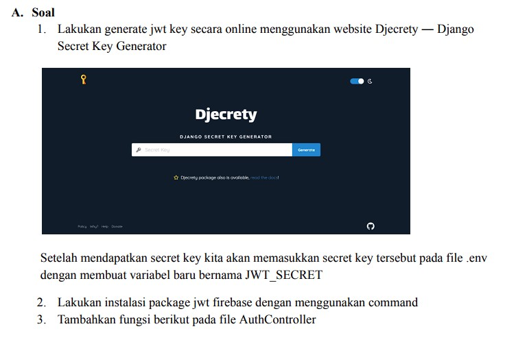

JSON WEB TOKEN (JWT)
------------------------------------------------
Latihan 1) 

Penjelasan
Untuk melakukan perubahan panjang kolom token pada file migrasi
add_column_token_to_users, langkah awalnya adalah membuka file migrasi terkait dan
mengubah panjang kolom token sesuai kebutuhan. Setelah itu, simpan perubahan tersebut
dan jalankan perintah php artisan migrate:fresh untuk membersihkan dan menjalankan
ulang seluruh migrasi. Setelah basis data diperbarui, gunakan Postman untuk
mengirimkan permintaan ke endpoint /auth/register dengan body request yang sesuai,
mencakup data seperti nama, email, password, dan konfirmasi password. Pastikan
aplikasi Laravel berjalan dan endpoint registrasi telah diimplementasikan dengan benar.
Dengan mengikuti langkah-langkah ini, Anda dapat memastikan perubahan pada kolom
token diterapkan dan endpoint registrasi dapat diuji menggunakan konfigurasi yang
diinginkan.

Latihan 2)

. Penjelasan
Dalam pada file AuthController.php, tiga fungsi baru, yaitu base64url_encode, sign, dan
jwt, telah ditambahkan untuk memperkaya fungsionalitas kontroler. Fungsi login dalam
file tersebut juga telah dimodifikasi sesuai kebutuhan. Pada file Authorization.php, empat
fungsi baru, termasuk base64url_encode, base64url_decode, sign, dan verify, telah
diimplementasikan untuk mendukung aspek otentikasi. Modifikasi juga dilakukan pada
implementasi fungsi handle. Selanjutnya, endpoint /auth/login dapat diuji menggunakan
Postman dengan menyertakan body sesuai permintaan, dan endpoint /home dapat
dijalankan dengan menyertakan token di header Postman. Keseluruhan perubahan ini
bertujuan untuk meningkatkan keamanan dan fungsionalitas autentikasi dalam aplikasi.

Latihan 3)

Penjelasan
proses implementasi autentikasi JWT pada proyek Lumen melibatkan beberapa langkah
kunci. Pertama, dibuat kunci JWT menggunakan Djecrety dan hasilnya ditambahkan ke
file .env. Selanjutnya, paket JWT Firebase diinstal melalui Composer, dan perubahan
dilakukan pada fungsi construct serta penambahan fungsi jwt pada AuthController.php.
Fungsi login dalam AuthController.php juga dimodifikasi untuk mendukung JWT. Selain
itu, middleware JwtMiddleware.php dibuat dan didaftarkan di direktori bootstrap,
sementara route /home ditambahkan di file web.php. Endpoint /auth/login dijalankan
dengan menggunakan body sesuai permintaan pada Postman, dan akhirnya, endpoint
/home diuji dengan menyertakan variabel token di header Postman. Dengan
langkah-langkah ini, autentikasi JWT berhasil diimplementasikan dalam proyek Lumen,
meningkatkan keamanan dan fungsionalitas aplikasi.

